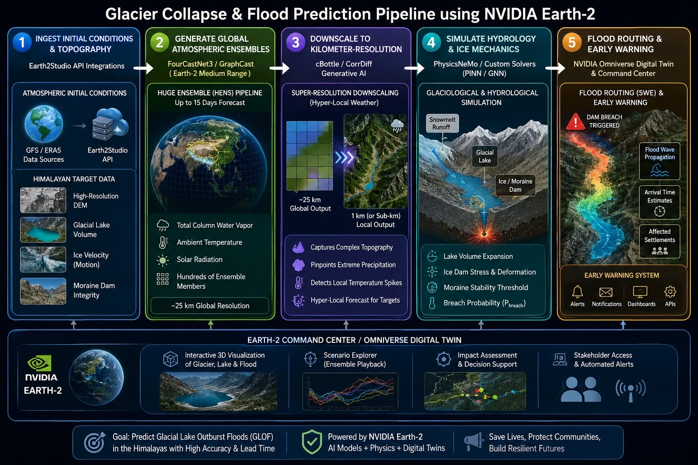

# Himalayan GLOF digital twin

An end-to-end digital twin for **glacial lake outburst floods** in the Hindu Kush
Himalaya, built on **NVIDIA Earth-2** (`earth2studio`) for the atmosphere,
**NVIDIA PhysicsNeMo** (`physicsnemo`) for the neural surrogates and generative
downscaling, and **NVIDIA Omniverse** (USD) for the visual deliverable.

The chain runs from a global weather forecast to an arrival time at a named
downstream settlement, with a calibrated breach probability attached:

```
Earth-2 forecast  →  CorrDiff downscaling  →  catchment melt and lake filling
      →  moraine stability (MeshGraphNet)  →  breach hydrograph
      →  flood routing (finite volume + FNO)  →  Omniverse USD scene
                 with ensemble Kalman assimilation of an in-situ network
```



---

## PhysicsNeMo is required, not optional

PhysicsNeMo supplies every neural component of the twin, and both tiers require
it. Model construction is centralised in `glof_pipeline/backends.py`, which raises
with an actionable message when a component is unavailable rather than substituting
a different implementation, so a run either uses the NVIDIA stack or does not
proceed. `run_manifest.json` records the resolved version of each component.


| Concern | Library API used |
|---|---|
| Flood-routing operator | `physicsnemo.models.fno.FNO` |
| Moraine mechanics | `physicsnemo.models.meshgraphnet.MeshGraphNet` |
| Downscaling backbone | `physicsnemo.models.diffusion_unets.SongUNetPosEmbd` |
| Diffusion parameterisation | `physicsnemo.diffusion.preconditioners.EDMPreconditioner` |
| Noise schedule | `physicsnemo.diffusion.noise_schedulers.EDMNoiseScheduler` |
| Sampler | `physicsnemo.diffusion.samplers.sample` (Heun) |
| Training objective | `physicsnemo.diffusion.metrics.MSEDSMLoss` |
| Checkpoints, logging | `physicsnemo.utils.checkpoint`, `physicsnemo.utils.logging` |
| Deterministic metrics | `physicsnemo.metrics.general.{mse, relative_error, power_spectrum}` |
| Ensemble verification | `physicsnemo.metrics.general.{crps, calibration}`, `earth2studio.statistics` |
| Forecast, data, perturbation, IO | `earth2studio.{models.px, models.dx, data, perturbation, io, run}` |
| Scene authoring | `pxr` (`UsdGeom`, `UsdShade`, `UsdLux`), optional `omni.client` |

Every NVIDIA import sits at **module scope** inside `glof_pipeline/nvidia/`.
Nothing elsewhere imports `physicsnemo` or `earth2studio` directly, so the
dependency surface is greppable and a missing component fails loudly with a
message naming it.

---

## Two tiers, one implementation

| | `toy` | `production` |
|---|---|---|
| Runs on | CPU laptop | CUDA host |
| Atmosphere | stochastic orographic generator | Earth-2 prognostic model + ensemble |
| Downscaling | PhysicsNeMo CorrDiff, 16 channels | PhysicsNeMo CorrDiff, 128 channels |
| Surrogates | PhysicsNeMo FNO + MeshGraphNet, narrow | the same, at production width |
| Grid | 160 × 160 at 50 m | 512 × 512 at 30 m |
| External data | none | GFS/IFS/ERA5, a DEM, site survey data |

The tiers differ in **size and data source, never in implementation**. A change is
tested on a laptop before it costs GPU-hours. Nothing is stubbed in either tier:
the melt is integrated, the stability field is solved, the shallow-water equations
are advanced, and the networks are trained.

---

## Quick start

```bash
./scripts/setup_env.sh cpu          # or: gpu
source .venv/bin/activate

glof info                           # resolved NVIDIA components and versions
pytest -q                           # unit + import/shape tests (~30 s)
./scripts/run_smoke.sh              # every stage, shrunk to seconds
```

The smoke tier executes the whole stage graph at reduced size, which is what
catches a stage-to-stage interface break. Unit tests by construction cannot.

For a full toy run:

```bash
glof run --config configs/toy.yaml
```

Any key is overridable inline:

```bash
glof run --config configs/toy.yaml --set runtime.seed=3 training.fno.epochs=5
```

---

## Command-line interface

| Command | Purpose |
|---|---|
| `glof info` | Resolved NVIDIA components, versions, CUDA availability |
| `glof run` | Full end-to-end pipeline, writes `run_manifest.json` |
| `glof dataset --which {moraine,swe,downscaling,all}` | Generate training data from the reference physics |
| `glof train --which {mgn,fno,downscaler,all}` | Train surrogates from stored datasets |
| `glof benchmark` | Measured surrogate-versus-solver cost and accuracy |

`python -m glof_pipeline` is equivalent to `glof`.

---

## Repository layout

```
glof_pipeline/
  nvidia/            every NVIDIA import, at module scope
    physicsnemo_models.py   FNO and MeshGraphNet construction
    corrdiff.py             two-stage CorrDiff on the current diffusion API
    earth2.py               forecast, downscaling, data sources, region safety
    launch.py               PhysicsNeMo checkpointing and logging
    statistics.py           Earth-2 and PhysicsNeMo verification metrics
    omniverse.py            layered USD authoring, materials, lighting, Nucleus
    _introspect.py          argument filtering against the installed signatures
  physics/           reference models the surrogates are trained against
    mass_balance.py         degree-day melt, rain/snow partition, lake filling
    moraine_stability.py    effective-stress limit equilibrium, piping, heave
    breach.py               Froehlich geometry, weir outflow, stage-storage
    swe_solver.py           well-balanced HLL finite-volume shallow water
  terrain/           synthetic valley, DEM ingest and delineation, graph meshing
  atmospheric/       initial conditions, forecast, kilometre-scale downscaling
  surrogates/        operator wrappers, losses, normalisation
  datasets/          training-set construction from the reference physics
  training/          three training loops
  assimilation/      in-situ network and ensemble Kalman filter
  hydrology/         moraine assessment, flood routing
  evaluate/          verification metrics and the measured benchmark
  visualization/     figures and the USD entry point
  pipeline.py        stage orchestration and the run manifest
configs/             component YAMLs + toy / production / smoke
docs/                architecture, NVIDIA map, production, GPU, validation, status
tests/               unit, integration and GPU-tier suites
```

---

## Configuration

Component files (`atmospheric_cfg.yaml`, `hydrology_cfg.yaml`,
`swe_routing_cfg.yaml`, `sensors_cfg.yaml`) each own one section. `toy.yaml`
includes them; `production.yaml` and `smoke.yaml` include `toy.yaml` and override.
Includes resolve recursively with cycle detection and deep-merge, and the merged
tree carries a 12-character content hash written into every run manifest.

A figure without a manifest hash is not a result.

---

## Testing

```bash
pytest -q            # unit + import/shape.  ~30 s, no training
pytest -m gpu -q     # end-to-end: trains three networks. GPU host only
```

`pyproject.toml` sets `addopts = "-m 'not slow and not gpu'"`, so the heavy suite
is deselected by default and never runs by accident on a laptop.

### Measured results

| Check | Result |
|---|---|
| Lake at rest over a rough bed (well-balanced) | max abs momentum 2.5 × 10⁻¹⁴ |
| Closed-basin mass conservation | relative error < 10⁻¹⁰ |
| Ritter dam break, t = 20 s | mean L1 / upstream depth = 0.36 % |
| Breach hydrograph vs released volume | within 2 % |
| Toy breach probability (8 members) | 0.88, earliest failure at 54 h lead |
| Light suite | 63 passed, 1 skipped, 8 deselected |

The single skip is the PhysicsNeMo MeshGraphNet forward pass, which needs
`torch_scatter`; the available wheel is ABI-incompatible with torch 2.10 on macOS.
It runs on the GPU host.

---

## Running on a GPU

See `docs/GCP_GPU.md` for machine types, driver and torch install ordering, data
staging and the staged run commands. In brief:

```bash
glof dataset --config configs/production.yaml --which all
glof train   --config configs/production.yaml --which all
glof run     --config configs/production.yaml --reuse-checkpoints
```

Three environment requirements, documented in full in `docs/NVIDIA_INTEGRATION.md`:

1. `physicsnemo.models` initialises Warp at import, which requires a writable
   kernel-cache directory. `glof_pipeline.nvidia.configure_warp_cache` sets both
   `WARP_CACHE_PATH` and `warp.config.kernel_cache_dir`, the latter being necessary
   once `warp.config` has already been imported in the process.
2. `SongUNetPosEmbd` concatenates `N_grid_channels` positional-embedding channels
   onto its input, so `in_channels` is declared as data channels plus grid
   channels, matching the convention in CorrDiff's own configuration files.
3. `MeshGraphNet` requires both `torch-geometric` and `torch-scatter`. Construction
   succeeds with the former alone; message passing requires the latter.

---

## Documentation

| File | Contents |
|---|---|
| `docs/ARCHITECTURE.md` | Stage graph, design decisions, configuration model |
| `docs/NVIDIA_INTEGRATION.md` | Every NVIDIA API mapped to its calling file, with verified signatures |
| `docs/PRODUCTION.md` | Running the production tier, checkpoint provenance |
| `docs/GCP_GPU.md` | Cloud GPU machine types, setup, staged commands, cost |
| `docs/VALIDATION.md` | What has been measured and what has not |
| `docs/STATUS.md` | Tracking checklist, with executed and unrun strictly separated |

---

## Scientific status — read this before quoting a number

This is a **complete and internally consistent model**, and it is **not a
validated forecasting system**. The distinction matters:

1. **No CorrDiff exists for this domain.** Published checkpoints cover Taiwan and
   central Europe. Applying one here fabricates orographic structure from the wrong
   mountain range, so `nvidia/earth2.py` refuses region-foreign checkpoints by
   default. Until one is trained for the Hindu Kush Himalaya, kilometre-scale
   fields are a structural demonstration.
2. **The geotechnical parameters are literature defaults, not survey.** Every value
   under `moraine.*` needs replacing with site data, and the toy dam geometry was
   deliberately tuned to sit near its stability boundary so the demonstration shows
   a probability between 0 and 1 — that is a pedagogical choice, not a measurement.
3. **No hindcast validation has been performed.** South Lhonak (Sikkim, 2023),
   Chorabari (Kedarnath, 2013) and Dig Tsho (Khumbu, 1985) are the obvious
   candidates. Arrival-time and peak-discharge errors against documented
   observations are the numbers that matter, not surrogate-versus-solver agreement.
4. **The breach probability is uncalibrated.** The reliability curve, Brier score
   and rank histogram exist in `evaluate/metrics.py`; calibration needs an event
   archive.
5. **The assimilation demonstration is a twin experiment.** It generates
   observations from a known truth, corrupts them with the configured instrument
   noise, drops a fraction for telemetry loss, and reports the reduction in
   normalised state RMSE. It shows the filter uses information; it does not show
   skill against real instruments.

Any operational use additionally requires review by the responsible national
agency before an output reaches a person downstream.

---

## License
MIT
